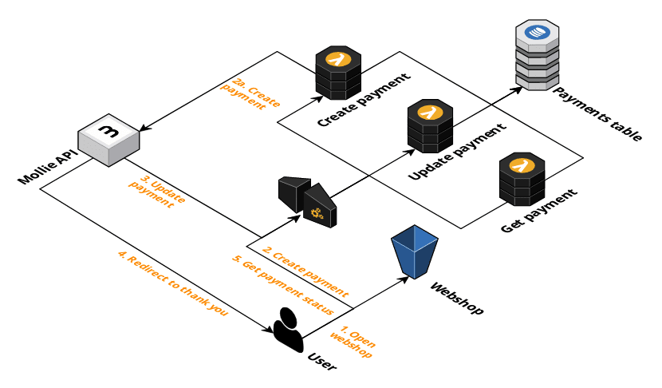

# Serverless Payment flow example

This repository contains a Serverless payment flow example. The following technology is used to build this flow:

* [Mollie](https://www.mollie.com/), a payment provider similar to Stripe and Adyen
* Amazon Web Services to host the application. The website is hosted in S3 and the API is built using API Gateway and Lambda. The state of the payment is stored in DynamoDB
* The [AWS CDK](https://github.com/aws/aws-cdk) to deploy the application

More information, including an in-depth walkthrough of the payment flow, can be found in my blog post: [A Serverless Payment Workflow using AWS Lambda and the AWS CDK
](http://sanderknape.com/2020/12/serverless-payment-workflow-lambda-cdk/)

Below you can find the steps required to deploy this architecture yourself.



## Prerequisites

Sign up for a [Mollie account](https://www.mollie.com/dashboard/signup). You can create an account without providing any payment details. Mollie will ask you to complete your account by providing additional information, but you can get started with their API without doing this.

After you have created an account you will have to;

* Open up the Payment Methods under Settings and enable at least the Credit Card payment method
* Find your test API key on the Developers page. We'll need this shortly
* Ignore all messages regarding completing your account

The code assumes you have a domain under your control in Route53. It'll create a subdomain under this domain which we'll use to access the API. If you don't have such a domain or prefer not to do this, you can;

* remove the `defaultDomainMapping` configuration in the stack
* remove the relevant code regarding setting up the domain
* update the various references to the domain of your API

You will need to make some manual changes before you can run the code.

* In `bin/cdk.ts`, set your AWS account ID and your preferred region to which to deploy the stack
* In `lib/payments-stack.js`, set your test Mollie API key and your Route53-controlled domain
  * **Important**: your Mollie API key will be visible to everyone with access to either your code or your AWS environment (the key will be configured as a plaintext Lambda environment variable). This is a **high security risk**, especially once you start using your live API key. It's recommended to instead use a tool like [AWS Secrets Manager](https://aws.amazon.com/blogs/security/how-to-securely-provide-database-credentials-to-lambda-functions-by-using-aws-secrets-manager/) to securily store and retrieve the API key.
* In the two website pages found under `src/website`, replace the API domain with the correct domain name

## Installation

First, ensure your shell is authenticated with the AWS account you want to deploy to.

Install the dependencies required for this project:

```bash
npm install
```

Build the CDK project and the Lambda functions:

```bash
npm run build
```

Next, bootstrap the CDK and deploy.

```bash
cdk bootstrap
cdk deploy
```

Your stack will be deployed after a few minutes. Find the `PaymentsStack.WebsiteUrl` output and open the URL in your browser. It may take a few minutes for the DNS entry to propagate.